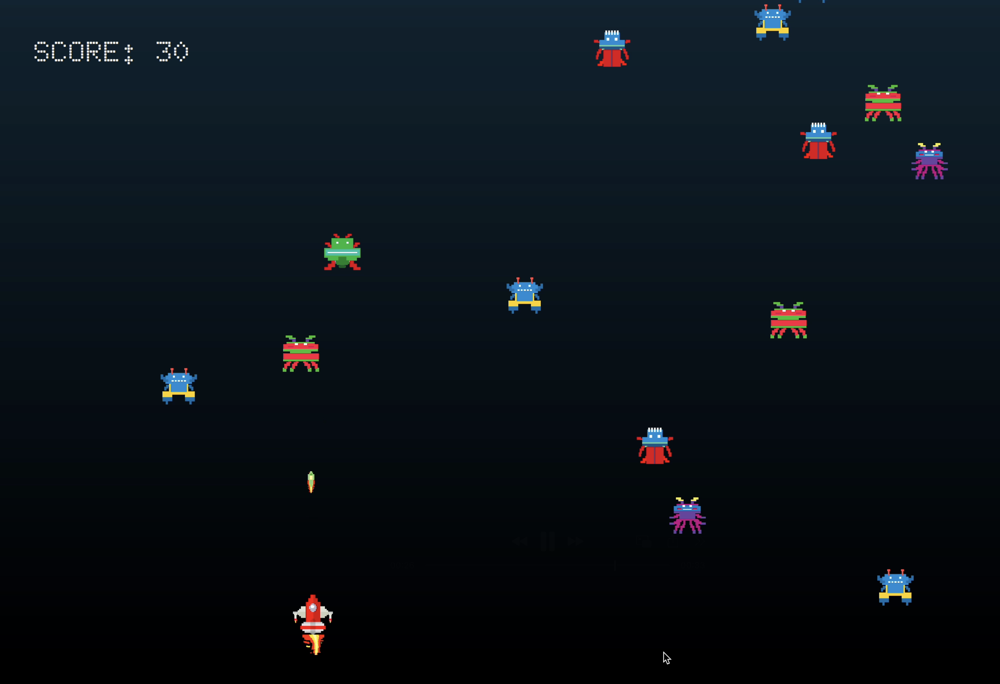
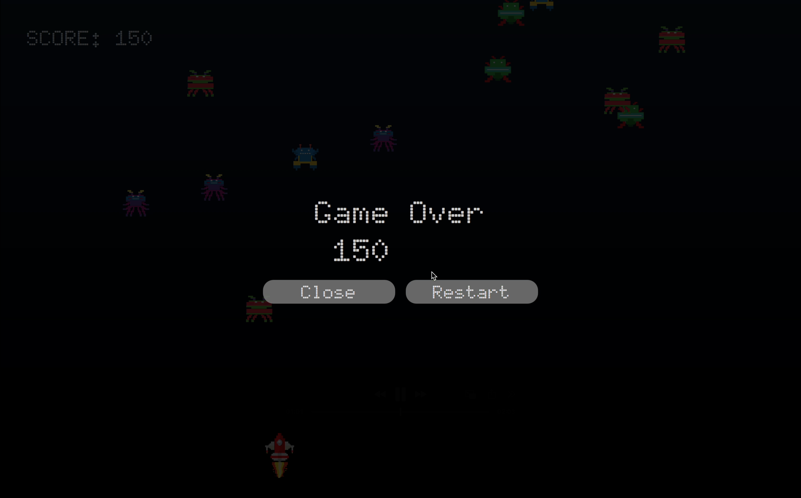

# 🚀 FireShip — A Retro Arcade Game in C++ & Qt/QML





Welcome to **FireShip**, a retro arcade-style game built using **Qt C++ and QML**, designed to teach beginners developers fundamentals step-by-step!

💥 Dodge enemies, fire bullets, and enjoy real-time pixel action: all while learning how to build a full game using C++ backend and QML frontend.

---

## 📽️ YouTube Tutorial Playlist

▶️ **Watch the full tutorial series here:**  
[🔗FireShip Tutorial Playlist on YouTube](https://youtube.com/playlist?list=PLeYV3WjZWmHyYUe-BElUVNeFYTmpOQ9Xq&si=3jaK6C5tifZCFmMv)

Learn:
- C++ logic integration
- Custom signals & slots
- Collision detection
- Dynamic game objects (bullets/enemies)
- Game over & restart flow
- More!

---

## 🎮 Game Features

- 🚀 Rocket with thrust and movement
- 👾 Multiple types of randomly spawning enemies
- 🔫 Bullet firing and collisions
- 💥 Blast animation on enemy hit
- 🎯 Game over overlay with Restart/Close
- 📈 Score tracking system

---

## 🧩 Tech Stack

| Layer      | Tech Used        |
|------------|------------------|
| Frontend   | Qt Quick / QML   |
| Backend    | Qt C++ (QObject) |
| Build      | CMake            |
| Assets     | Pixel art PNG/GIF |
| Animations | `AnimatedImage`, custom logic |

---

## 🛠️ Setup Instructions

1. **Clone the repository**:
```bash
git clone https://github.com/kaustuvpokharel/FireShip.git
cd FireShip
```

2. **Install Qt 6.2+** with Qt Creator and make sure `Qt Quick` and `CMake` are installed.

3. **Build the project**:
```bash
mkdir build
cd build
cmake ..
make
```

4. **Run the game**:
```bash
./appuntitled3
```

---

## 📂 Project Structure

```
├── Bullet.cpp/h + Bullet.qml      # Bullet movement + visuals
├── Enemy.cpp/h + Enemy.qml        # Random enemy logic and sprite
├── Controller.cpp/h               # Main game logic and backend
├── main.qml + main.cpp            # App entry point
├── CMakeLists.txt                 # Build config
├── assets/                        # All PNGs, GIFs and pixel art
├── Blast.qml                      # Blast animation component
└── README.md                      # You’re here!
```

---

## 🧠 Key Concepts You’ll Learn

- `QQmlListProperty<T>` usage for dynamic QML list binding
- Handling `QTimer` updates at 60FPS
- Game loop and logic in C++
- Interactive QML overlays and UI
- Keyboard input handling in QML
- Combining QML with C++ for real-time game programming

---

## 🙌 Support the Channel

If this game or tutorial helped you, consider:

- ⭐ Starring the repo
- 🔔 Subscribing on YouTube
- 💬 Leaving feedback or ideas!

---

Made with ❤️, C++, and pixel fire.
